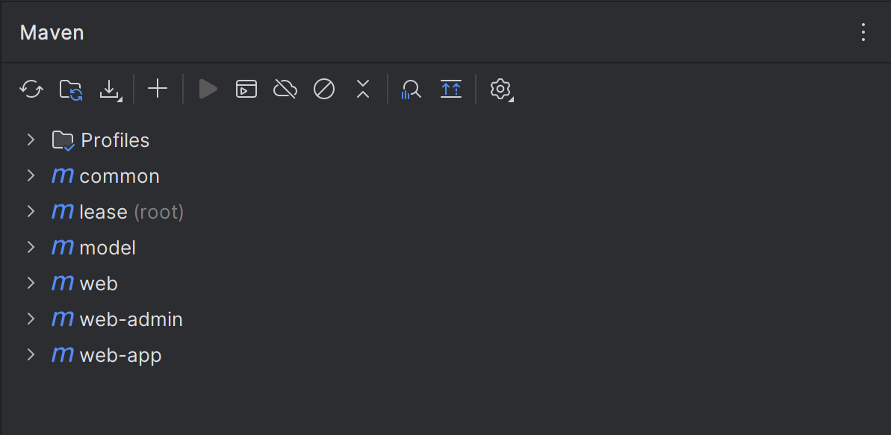
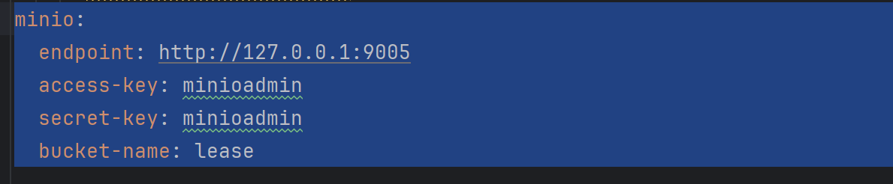
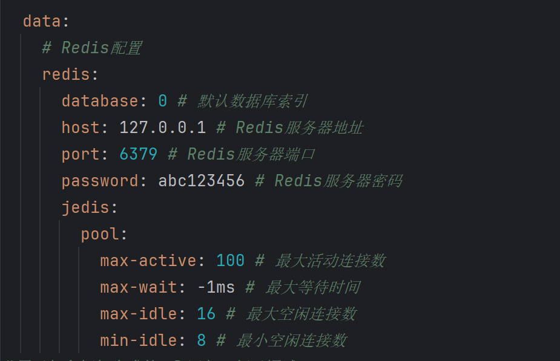
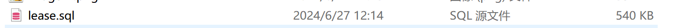
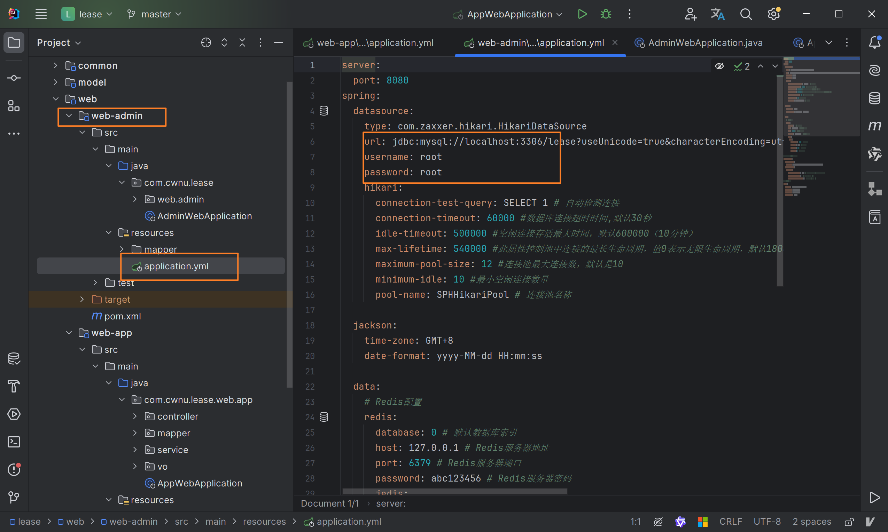
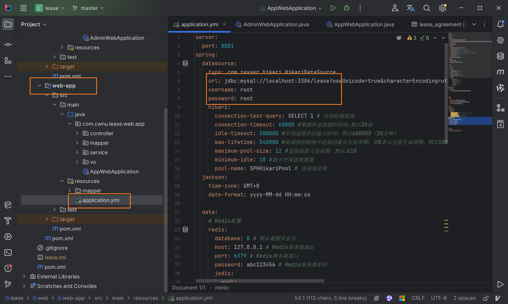
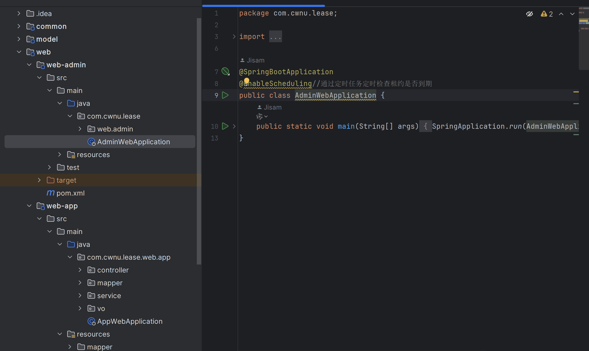
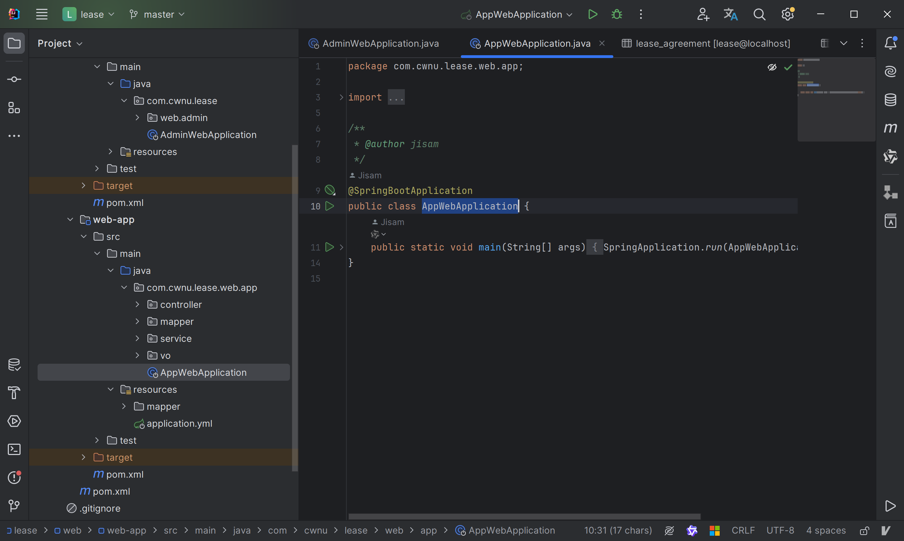
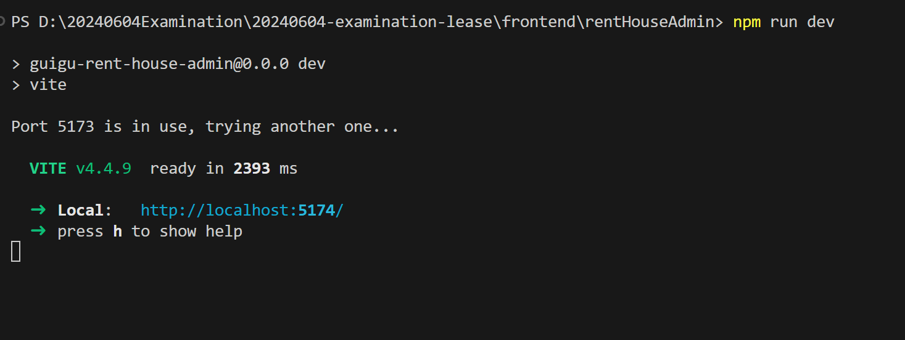

## 1 后台启动
### 1.1 启动后端项目
#### 1.1.1 刷新pom文件

#### 1.1.2 创建并启动minIO
    配置文件如下

#### 1.1.3 创建并启动redis
    配置文件如下

#### 1.1.4 导入数据库并修改yml
    lease.sql

修改yml文件中的数据库密码

    lease/web/web-admin/src/main/resources/application.yml



    lease/web/web-app/src/main/resources/application.yml


### 1.2 启动应用
#### 1.2.1 启动后台管理系统
    运行AdminWebApplication

#### 1.2.2 启动后台管理系统
    运行AppWebApplication


## 2 后台管理系统前后端联调

### 2.1 启动后端项目

启动后端项目，供前端调用接口。

### 2.2 启动前端项目

#### 2.2.1 安装Node和npm

1. **部署Node和npm**

   Node和npm的部署比较简单，拿到安装包后按照安装向导操作即可。

2. **配置npm国内镜像**

   为加速npm下载依赖，可以为npm配置国内镜像，在终端执行以下命令为npm配置阿里云镜像。

   ```bash
   npm config set registry https://registry.npmmirror.com
   ```

#### 2.2.2 启动前端项目

1. **导入前端项目**

   将后台管理系统的前端项目（**rentHouseAdmin**）导入`vscode`或者`WebStorm`，打开终端，在项目根目录执行以下命令，安装所需依赖

   ```bash
   npm install
   ```

2. **启动前端项目**

   上述配置完成之后，便可执行以下命令启动前端项目了

   ```bash
   npm run dev
   ```
   

4. **访问前端项目**

   在浏览器中访问前端项目，并逐个测试每个页面的相关功能。
   
## 3 移动端前后端联调

### 3.1 启动前端项目

1. **导入前端项目**

   将移动端的前端项目（**rentHouseH5**）导入`vscode`或者`WebStorm`，打开终端，在项目根目录执行以下命令，安装所需依赖

   ```bash
   npm install
   ```

2. **启动前端项目**

   上述配置完成之后，便可执行以下命令启动前端项目了

   ```bash
   npm run dev
   ```

3. **访问前端项目**

   在浏览器中访问前端项目，并逐个测试每个页面的相关功能。